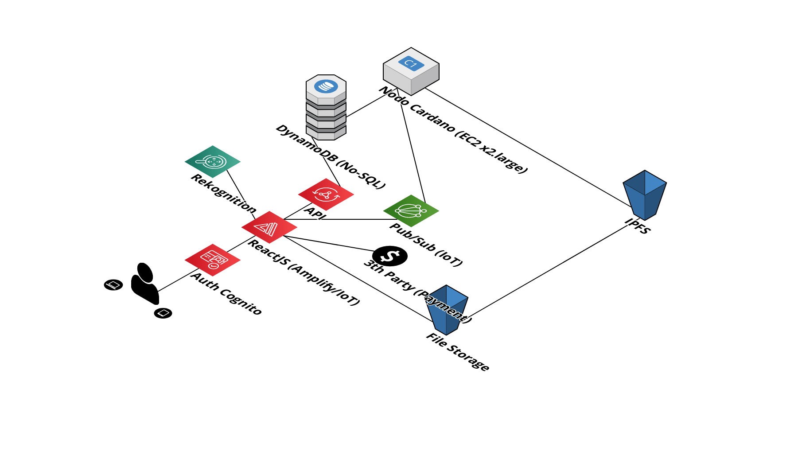
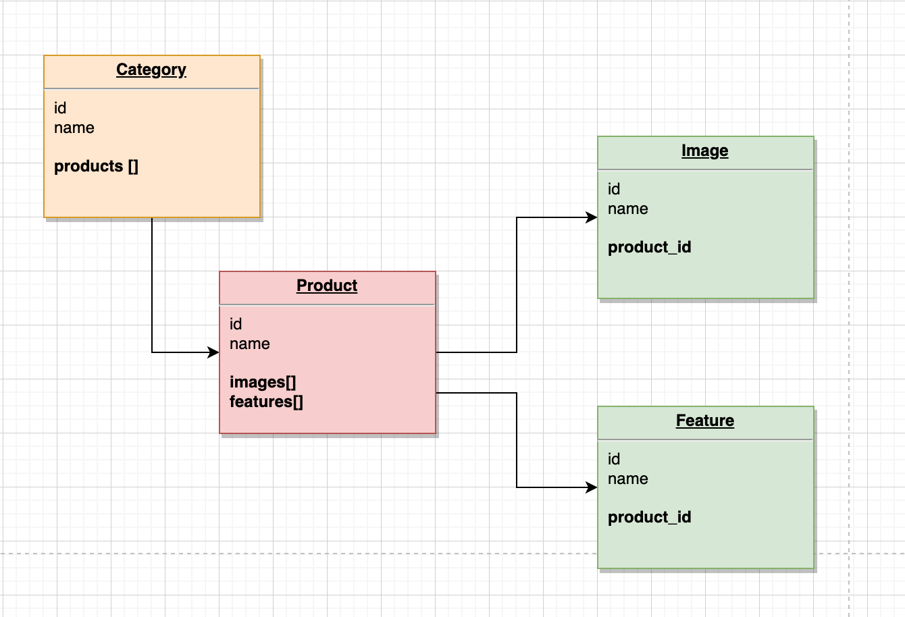

# AGENDA
1. Arquitectura
2. Modelo Entidad Relacion
3. AWS Amplify Docs
4. README.md 
5. Amazing Teepee Parties
   - AWS Cognito (Auths)
   - AppSync
   - S3

# 1. Arquitectura

# 2. Modelo Entidad Relación

# 3. Amplify Docs

[Amplify Docs](https://docs.amplify.aws/)

# 4. README paso a paso

[Paso a paso](../00_REACT_JS_APP/README.md)

# 5. Amazing Teepee Parties
